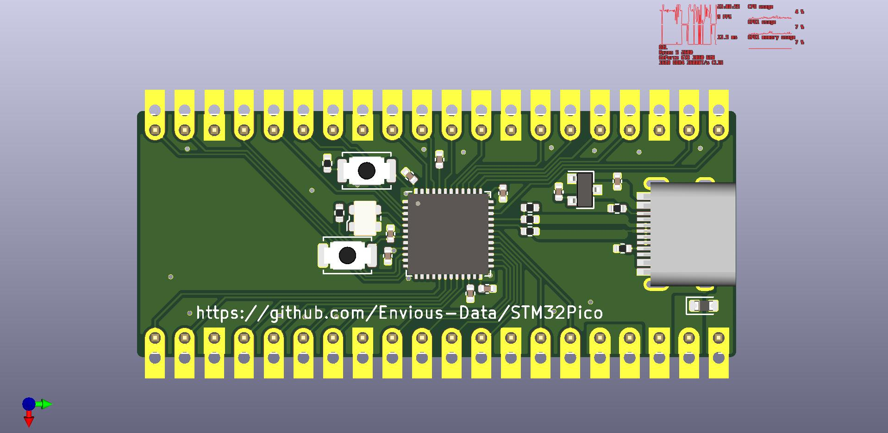

# STM32Pico
A STM32 board in the format of a raspberry pi pico.

Im making this just so I can test out some other MCUs and also learn more about MCU board design, because I have things that use the raspberry pi pico I would like to make some replacements if there is a particular use case.

